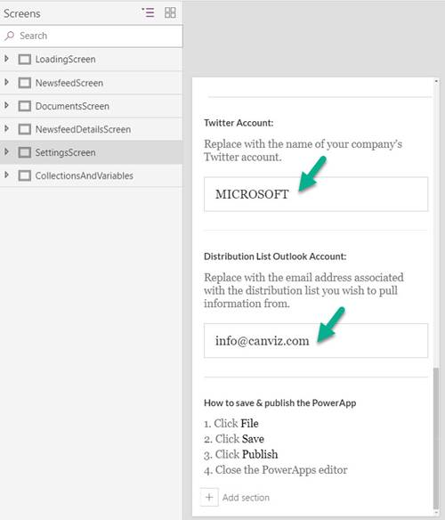
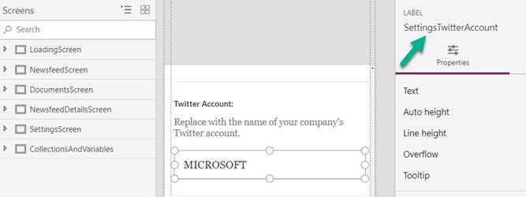

## Configuration values

You likely use SaveData and LoadData to store user-defined settings in your mobile apps. They provide a handy way of caching data.

**Note:** SaveData and LoadData _work only inside the PowerApps player client app._ Keep this limitation in mind as you design your apps, because these functions won&#39;t work when PowerApps apps are loaded in web browsers.

Your app will probably need to have application settings that can be easily changed in one place, such as color schemes, URLs to other apps, or settings that define whether debugging controls are visible on app screens. Therefore, the people who deploy your application can quickly set those values, and there&#39;s less risk that the code will be messed up during deployments. Think of these settings like an ASP.NET [web.config](https://msdn.microsoft.com/en-us/library/ff400235.aspx) file.

Here are several approaches to storing configuration values, in order of increasing difficulty.

### Creating a hidden configuration screen

A surprisingly easy way of setting configuration values is just to create a hidden screen and put your configuration values in text input controls. In this way, you can change application settings without editing code. To use this approach, follow these steps:

1. Make sure that the configuration screen isn&#39;t the first screen in the application. Pu it anywhere else in your screen order. We recommend that you make it the last screen, so that it&#39;s easily found.
2. Make sure that your users can&#39;t go to the screen.
3. Give yourself a way of going to the screen. The easiest way is to make the screen accessible only when the app is edited, and then manually go to the screen. On the home screen of the app, you might even have a hidden button that&#39;s only visible to app makers and admins, and that lets them go to the configuration screen. You can verify that users are app makers or admins by checking their email address (for example, check User().Email) or their AAD group membership, or use the PowerApps for Makers connector.

The following example is from the Microsoft PowerApps Company Pulse sample template. Here, you can see text input controls that let the PowerApps admin configure application setting values.

Here, you can see the name of the control that stores the Twitter account settings value.

​

Here, you can see where the value is used to return tweets for the Twitter account from the Twitter connector.

Although this approach is the easiest way of changing values, it does have some downsides:

- You must republish the app to change values and make them persist.
- Because values persist in the app, you must create a process that removes these values before you export the app in preparation for a move to another environment.

### Storing configuration values in Common Data Service for Apps

Alternatively, you can create a new Common Data Service for Apps entity and store configuration values there. Because the values persist outside the app, they can be modified at any time without redeploying the app. Common Data Service for Apps entities can have unique values per environment. Therefore, URLs can be different in pre-production and production environments.

Although this approach is a great way of maintaining configuration values, it also has downsides:

- Unlike the text input control approach, this approach requires a call-back to Common Data Service for Apps. Therefore, there will be a slight effect on performance, and if Common Data Service for Apps is unavailable (for example, if the user is on a mobile device and loses his or her connection), the app might not be shown correctly.
- Because there&#39;s no caching, a new call will be made every time the app is opened.
- There&#39;s no monitoring if the call fails. You&#39;ll have to rely on your users to inform you of app failures.

### Using a custom API

Although implementation approach is the most difficult, Microsoft IT has had success with an Azure app service that stores configuration values as name/value pairs in Azure Table storage.

An OAuth secured custom connector fetches the configuration values, and output caching (which includes cache invalidation as values change) enhances performance. Azure Application Insights with alerts sends notifications when there&#39;s an issue and makes it much easier to troubleshoot a user session.