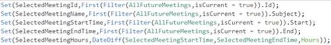
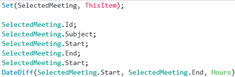
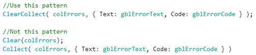

## General coding guidelines

### Click targets

If actions should be performed when a group of controls is clicked, there are three approaches that you can use:

- The simplest approach is to group the controls and then assign click events to the group&#39;s OnSelect property.
- Put the code in one of the controls in the group (the most significant control), and then add Select(_controlWithLogic_) to the OnSelect property of all the other controls in the group. As for the first approach, no additional controls are required, and the controls can easily be selected in the editor.
- Lay a transparent rectangle on top of the group, and use the rectangle&#39;s OnSelect property.

We recommend the third approach, because code isn&#39;t affected as much if the controls in the group change. This approach also gives the maker more flexibility about the shape of the clickable region. Although the controls inside the rectangle are more difficult to select directly on the screen, you can select them individually in the **Screens** pane on the left side of the editor.

For more information about this approach, see the article [HOW TO: Use Transparent Rectangles Effectively In a PowerApp](http://toddbaginski.com/blog/how-to-use-transparent-rectangles-effectively-in-a-powerapp/) article by Todd Baginski.

### Variables and collections

#### Context variables

Limit your use of context variables. Try to use them only when they&#39;re absolutely necessary.

Know when to use context variables versus global variables. Use a global variable when you need it to be available on all screens. Use a context variable if you want to limit the scope of a variable to a single screen.

Avoid passing context variables between screens when a global variable might be more appropriate (and much easier to debug).

Update all necessary context variables in a single UpdateContext call. In this way, you make your code more efficient and easier to read.

For example, use this call to update several context variables.

Don&#39;t use these separate calls.

#### Global Variables

Don&#39;t use multiple variables when you can use just one. Here&#39;s an example of multiple variables.

Instead, you can use just one variable, as shown here.

#### Collections

Limit your use of collections. Try to use them only when they&#39;re absolutely necessary.

Use ClearCollect instead of Clear;Collect.

To count the records in a local collection, use CountIf instead of Count(Filter()).

### Nesting

Avoid using unnecessary DataCards and canvases, especially if they have nested galleries. (Nested galleries won&#39;t work in the future.)

Avoid nesting in other operators too, such as the ForAll function.

