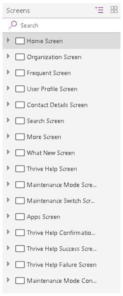
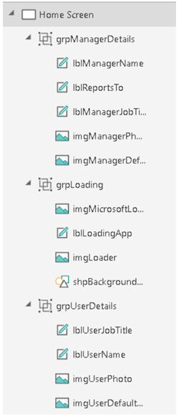
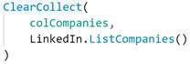
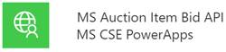
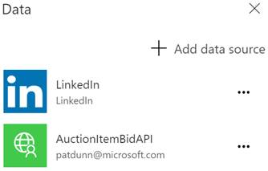

## Object naming conventions

As you create objects in your PowerApps apps, it&#39;s important to use consistent naming conventions for screens, controls, and data sources. This approach will make your apps easier to maintain, can help improve accessibility, and will make your code easier to read as those objects are referenced.

**Note:** As we were preparing this white paper, we found lots of variance in the naming conventions of different organizations. One experienced maker renames her controls only if they&#39;re referenced in formulas. Several makers prefer different prefixes for their controls.

This is OK! The object naming conventions in this white paper are intended as guidelines, and organizations are free to develop their own standards. The main point is to be consistent.

### Screen names

Screen names should reflect the purpose of the screen, so that it&#39;s easier to navigate through complex apps in PowerApps Studio.

What&#39;s less obvious is that screen names are read aloud by screen readers, which are needed for users who have vision accessibility needs. Therefore, ***it&#39;s imperative that you use plain language to name your screens, and that the names include spaces and no abbreviations***. Also, _we recommend that you end the name with the word &quot;Screen,&quot; so that the context is understood when the name is announced._

Here are some good examples:

- Home Screen
- Thrive Help Screen

Here are some bad examples:

- Home
- LoaderScreen
- EmpProfDetails
- Thrive Help

### Control names

All control names on the canvas should use camel case. They should begin with a three-character type descriptor, followed by the purpose of the control. This approach helps identify the type of control and makes it easier to build formulas and search.

Here&#39;s a good example: lblUserName

The following table shows the abbreviations for common controls.

| **Control name** | **Abbreviation** |
| --- | --- |
| button | btn |
| camera control | cam |
| canvas | can |
| card | crd |
| collection | col |
| combo box | cmb |
| dates | dte |
| drop down | drp |
| form | frm |
| gallery | gal |
| group | grp |
| header page shape | hdr |
| html text | htm |
| icon | ico |
|   |     |
|   |     |
| image | img |
| label | lbl |
| num – numbers and integers (you should rarely use int for integers) | num |
| page section shape | sec |
| shapes (rectangle, circle, and so on) | shp |
| table data | tbl |
| text input | txt |
| timer | tim |

Control names must be unique across an application. If a control is reused on multiple screens, the short screen name should be suffixed at the end – for example, galBottomNavMenuHS, where &quot;HS&quot; stands for &quot;Home Screen.&quot; This approach makes it easier to reference the control in formulas across screens.

Here are some bad examples:

- zipcode
- Next 
 

As the following image shows, if you consistently name your controls, your app will be much cleaner in the navigation view, and your code will be much cleaner too.

### Data source names

When you add a data source to your application, the name can&#39;t be changed in the PowerApps app. The name is inherited from the source connector or data entities that are derived from the connection.

Here are some examples:

- **Name inherited from the source connector:** The Office 365 Users connector is named Office365Users in your code.
- **Data entities derived from the connection:** A Microsoft SharePoint list that&#39;s named **Employees** is returned from the SharePoint connector. Therefore, the name of the data source in your code is Employees. The same PowerApps app can also use ***the same SharePoint connector*** to access a SharePoint list that&#39;s named Contractors. In this case, the name of the data source in the code is Contractors.

For more information about connectors and connections, see the [Overview of canvas-app connectors for PowerApps](https://docs.microsoft.com/en-us/powerapps/maker/canvas-apps/connections-list) article.

#### Standard action connectors

In Standard action connectors that expose functions, such as LinkedIn, you&#39;ll see that the data source name and its operations use Pascal casing (that is, UpperUpperUpper). For example, the LinkedIn data source is named LinkedIn and has an operation named ListCompanies.

#### Custom connectors

Custom connectors can be created by any maker in your environment. They&#39;re used to connect to custom application programming interfaces (APIs) such as third-party services or line-of-business APIs that your IT department has created. Pascal casing is also recommended for the data source name and its operations. Just be aware that the custom connector name and the way that it appears in PowerApps can differ.

For example, here&#39;s a custom connector named **MS Auction Item Bid API**.

But when you create a connection from this connector and add it to your PowerApps app as a data source, it appears as **AuctionItemBidAPI**.

To discover the reason, you can look inside the OpenAPI file. There, you&#39;ll see a title attribute that contains the text Auction Item Bid API.

PowerApps removes all the spaces from this attribute value and uses it as the name of your data source. We recommend that you change the value of this attribute to a Pascal-cased name such as AuctionItemBidAPI and use it as the name of your custom connection. In that way, there will be no confusion. Change this value before you import the OpenAPI file to create the custom connector.

**Note:** If you use the **Create from blank** option instead of importing an existing OpenAPI file, PowerApps will prompt you for the custom connector name. This name will be used both as the name of the custom connector and as the value of the title attribute inside the OpenAPI file. Once again, if you just use a Pascal-cased name such as AuctionItemBidAPI, you&#39;ll be fine.

#### Excel DataTables

PowerApps uses DataTables in Microsoft Excel to connect to data in Excel worksheets. Keep these points in mind when you create Excel documents as data sources:

- Give your DataTables descriptive names. You&#39;ll see the name in the PowerApps app when you write the code to connect to it.
- Use one DataTable per worksheet.
- Give the same name to the DataTable and worksheet.
- Use descriptive column names in the DataTables.
- Use Pascal casing. Each word of the DataTable name should begin with a capital letter (for example, EmployeeLeaveRequests).
