## Organizing your objects and code

### Using groups for organization

All controls on a screen should belong to a group, so that you can easily recognize their purpose, move them around a screen or between screens, or collapse them to simplify your view. Gallery, Form, and Canvas controls are already groups, but they can also, optionally, be part of another group to help improve organization.

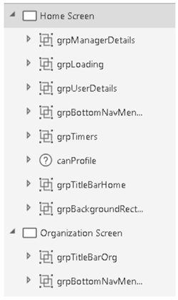

Optionally, you can use the experimental [enhanced Group control](https://powerapps.microsoft.com/en-us/blog/enhanced-group-experimental-control-with-layout-control-and-nesting/), which allows for nesting of groups, group-level settings, keyboard navigation, and more.

### Format text feature

As the complexity of a formula increases, readability and maintainability are affected. It can be very difficult to read a large block of code that contains multiline functions. The **Format text** feature adds line breaks and indentation to make your formula easier to read. As for code comments, the extra white space is removed from the app package that&#39;s downloaded to the client. Therefore, there&#39;s no need to use the **Remove formatting** feature before you publish your app.

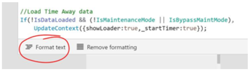

### Minimizing the number of controls that you create

To minimize complexity, try to limit the number of controls in your apps. For example, instead of having four image controls that lie on top of each other and have different Visible property settings, use one image that includes logic in its Image property to show different images.

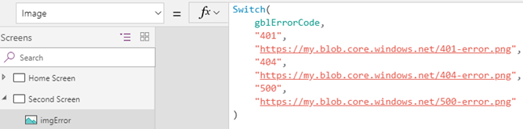

### Finding the best place for your code

As the complexity of your PowerApps apps increase, it can become more difficult to find your code when it&#39;s time to debug an application. A consistent pattern makes this challenge easier. Although this section isn&#39;t exhaustive, it provides some guidelines about the best place for your code.

As general guidance, try to move your code to the &quot;top level&quot; as much as possible, so that it&#39;s easier to find in the future. Some makers like to put code in the OnStart property. This approach is fine, provided that you understand the OnStart property&#39;s limitations, and possible perceived implications for app performance. Other makers prefer to put code in the OnVisible property, because it&#39;s easy to find, and code reliably runs whenever the screen is visible.

#### Code encapsulation

Whenever possible, try not to distribute your code across screens, so that all the code resides on one screen. For example, one maker built a people browser app that shows the organizational hierarchy in a gallery. When a user clicks a name, the app goes to a new screen and shows the employee profile. In this case, the maker didn&#39;t put the logic to load the profile in the gallery&#39;s OnSelect property. Instead, the app just passes any variables that are needed on the next screen as context variables in the Navigate function. The **User Profile** screen does all the work to load the user profile.

Here&#39;s the Navigate function in the gallery&#39;s OnSelect property for this example.

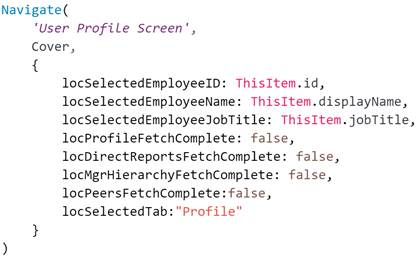

Then, in the OnVisible property of the **User Profile** screen, call Office365Users.UserProfileV2 by using the user ID that was received from the previous screen. Subsequent code then uses the other context variables that were passed.

**Note:** The previous example passes ThisItem values as context variables instead of having the next screen refer to the Selected property of the previous screen. This approach was used deliberately, because this app has multiple paths to the **User Profile** screen from other screens that include galleries. The screen is now encapsulated and can easily be reused in this app and other apps.

#### OnStart property

In general, try to limit the code that you put in the OnStart property, because it&#39;s difficult to debug. To debug code there, you must save, close, and then reopen your PowerApps app in PowerApps Studio to make the code run again. You can&#39;t create context variables in this property. Think of it as Application.OnStart, which runs only once before any screen is shown.

Here are the recommended uses for OnStart:

- **Screen routing** : Unlike the OnVisible property, you can use the Navigate function in the OnStart property. Therefore, it can be a handy place to make routing decisions. For example, you can evaluate a parameter named mode to determine which screen to show.

  

- **Impersonation or debug privileges** : You can create code in the OnStart property to check whether the current user is on a list of email addresses and, if the user is on the list, turn on a debug mode that shows hidden screens and text input controls.

  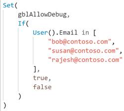

  **Note:** You can also check Azure Active Directory (AAD) group membership to apply security settings to your apps.
 
- **Static global variables** : Use the OnStart property to create collections of error messages or set global style variables, such as control colors and border widths. For another approach, see the [Creating a hidden configuration screen](#_Creatinge_a_hidden) section later in this white paper.
- &quot; **Run once&quot; code** : By its definition, code that&#39;s put in the OnStart property runs only once, while the app is starting but before the first screen is visible. On the other hand, code in the OnVisible property runs every time a user goes to that screen. Therefore, if you need your code to run only once, consider putting it in the OnStart property.
- **Code that runs quickly:** For specific guidance about the OnStart property, see the [Optimizing for performance](#_Optimizing_for_performance) section later in this white paper.

For more information about the OnStart and OnVisible properties, watch the [PowerApps OnStart and OnVisible Development Tricks](https://www.youtube.com/watch?v=pMPlxitxs9E) video by Todd Baginski.

#### OnVisible property

The OnVisible property is the place to put code that must run every time a user goes to a screen. Be careful about putting code in this property. If possible, avoid putting logic in the OnVisible property on the first screen of your PowerApps app. Instead, try to use inline expressions in control properties.

The OnVisible property is a great place to set global or context variables. However, be careful about the calls that you make to set those variables. Quick calls, such as calls to Office365Users.Profile or calls to set a static color for reuse in controls, are acceptable. However, stay away from complex logic and code that takes a long time to run.

For more information about performance issues that are related to the OnVisible property, see the [Expensive calls](#_Expensive_calls) section later in this white paper.

#### OnTimerStart property

Timers present interesting possibilities for event-based code execution. Typically, makers hide timer controls and set the Start property to watch a Boolean variable or control state.

For example, if you want to have a form that lets the user switch an auto-save feature on and off, you can create a toggle control that&#39;s named tglAutoSave. A timer on the screen then has its Start property set to tglAutoSave.Value, and code in the OnTimerStart property can save the data.

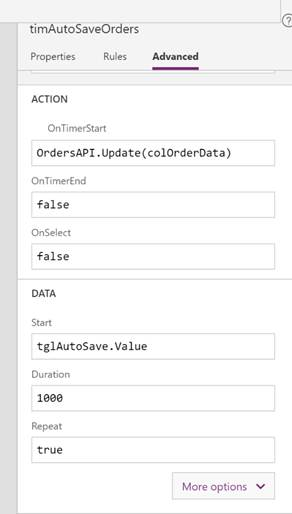

the OnTimerStart property, you can also put code that uses the ClearCollect function to reload data at a specified refresh interval.

The OnTimerStart property also supports the Navigate function. You can use it to go to another screen when specific conditions are met. For example, a loader screen sets a Boolean context variable when all data has been loaded, and the timer then goes to a data display screen. Alternatively, you can use this property to go to a &quot;Session timed out&quot; message screen after a period of inactivity.

This pattern comes with two caveats:

- The timer won&#39;t fire when you&#39;re editing the app in PowerApps Studio. Even if AutoStart is set to true, or an expression is evaluated as true in the Start property, the OnTimerStart property code won&#39;t be triggered. However, it will be triggered when you switch to Preview Mode (F5).
- Before the Navigate function fires, there can be enough of a delay for additional code to run on the screen.
<be>
  For example, you have a timer control on a loader screen. You set the control&#39;s Start property to locRedirect, a Boolean context variable, and you put the following navigation code in the OnTimerStart property.

  

  The OnVisible property of the loader screen retrieves the employee ID and sets locRedirect to false if the ID isn&#39;t numeric (because non-numeric employee IDs are error conditions).

  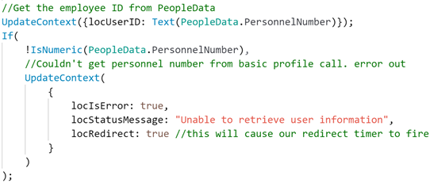

  When locRedirect is set to true, the timer control&#39;s OnStart code runs, but there&#39;s a slight delay, during which code in the OnVisible property continues to run. Therefore, do an additional error check for the next few lines of code.

  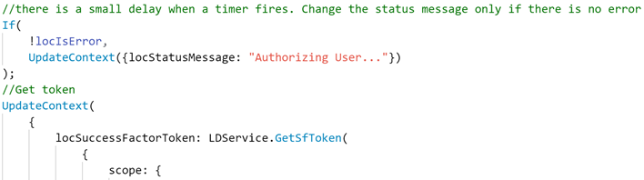

#### OnSelect property

Code in the OnSelect property of a control runs whenever that object is selected. Object selection can occur through user interaction, such as the click of a button or selection of a text input control. The code that runs here can validate form data and show validation messages or hint text, or it can read from and write to your data source.

**Note:** Avoid putting long-running code in the OnSelect property, because long-running code can give the impression that the application has stopped responding. For more information, see the [Optimizing for performance](#_Optimizing_for_performance) and [Expensive calls](#_Expensive_calls) sections later in this white paper. Also consider loading indicators or status messages to help prevent the perception of slowness.

Code that&#39;s put in the OnSelect property will also run when the control is selected by using the Select function. A useful pattern is to have a loader screen as the first screen of the application. A label control can show a message such as &quot;Loading app data.&quot; The OnSelect property of this label control can call your data sources and initialize variables, and then navigate to the home screen of the application. The label control is then selected by calling the Select function in the application&#39;s OnStart property.

Although the initialization code can also reside in the OnStart or OnVisible property, there are benefits to this approach:

- OnVisible code doesn&#39;t allow for navigation. Therefore, you must add navigation code to a control, such as a timer.
- OnStart code will prolong the splash screen or, if the **Use non-blocking OnStart rule** preview feature is turned on, might have unexpected results.
- When the label control is programmatically selected, users who have a vision impairment will hear the text of the label control read to them by their screen reader as data is loaded. This pattern provides a great experience when a screen reader is used, as the user hears &quot;Loading screen,&quot; &quot;Loading app data,&quot; or &quot;Home screen.&quot;

**Caution:** If you use the Select function in the OnVisible property to select a control, and that control then uses a Navigate function to go to another screen, it might not be possible to edit the screen. To avoid this situation, use a toggle control on a hidden settings screen in the app. Then check the state of this toggle in the OnSelect property before you call the Navigate function.

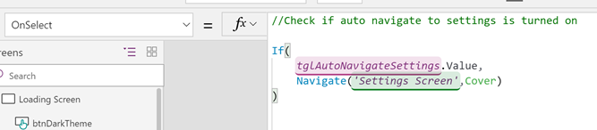

### Other tips for organization

- Don&#39;t &quot;nest&quot; secondary logical tests by explicitly writing If after the initial statement.

  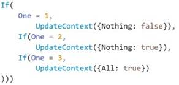

- To write secondary logical tests, just write the logical test, without explicitly writing If.

  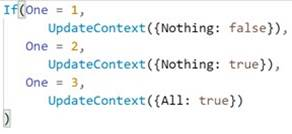

- Avoid lengthy expressions whenever possible.
- To manually format your code, follow these guidelines:
  - Each semicolon should represent a line break.

    

  - For long single-line formulas, try to insert line breaks in reasonable places: before and after parentheses, commas, and colons.